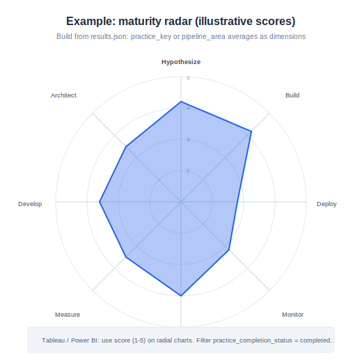
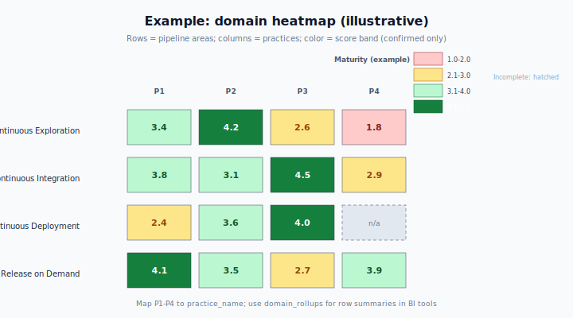

# SAFe DevOps Self-Assessment

**Guided maturity reflection for teams** — a web application that walks participants through **16 configurable practices** mapped to the four aspects of the **SAFe Continuous Delivery Pipeline**. Teams answer **one practice at a time** with narrative (and optional evidence). An **AI sufficiency review** asks targeted follow-ups before a practice can be confirmed. **Numeric maturity scores stay hidden** until the **final summary** and **ZIP export**, reducing score-chasing and encouraging evidence-based answers. Exports include **`report.pdf`** and **`results.json`** for records and for **radar charts, heatmaps, and dashboards** in tools such as Tableau or Power BI.

[](https://sonarcloud.io/summary/new_code?id=carlosevp_SAFeDevOps) [](https://snyk.io/test/github/carlosevp/SAFeDevOps)

**License:** [MIT](LICENSE)

> **Disclaimer:** This repository is an **independent open-source pilot**. It is **not** affiliated with or endorsed by Scaled Agile, Inc. Methodology descriptions below **summarize publicly documented SAFe concepts** in original wording. Assessment content, rubrics, and practice names are **editable YAML**; align them with your coaches, SPCs, and organizational standards. Diagrams under [`docs/images/`](docs/images/) are **original SVG illustrations**, not SAFe figures.

---

## Contents

- [Overview](#overview)
- [Purpose](#purpose)
- [SAFe DevOps and the Continuous Delivery Pipeline](#safe-devops-and-the-continuous-delivery-pipeline)
- [Default practices (16)](#default-practices-16)
- [Maturity model](#maturity-model)
- [Visual analytics with exported JSON](#visual-analytics-with-exported-json)
- [System architecture](#system-architecture)
- [Configuration-driven assessment](#configuration-driven-assessment)
- [Export bundle (PDF + JSON)](#export-bundle-pdf--json)
- [Partial completion and finish early](#partial-completion-and-finish-early)
- [Capabilities](#capabilities)
- [Prerequisites](#prerequisites)
- [Local development](#local-development)
- [Environment variables](#environment-variables)
- [Docker](#docker)
- [Deployment](#deployment)
- [Branding and documentation images](#branding-and-documentation-images)
- [Troubleshooting](#troubleshooting)
- [References](#references)
- [Contributing](#contributing)

---

## Overview

| Aspect | Detail |
|--------|--------|
| **Interaction** | Linear practice flow with save-as-you-go, optional file uploads (PNG, JPEG, WebP, GIF, PDF; 15 MB each). |
| **AI role** | Checks whether the narrative is **specific enough to score fairly**; proposes **1–3 follow-up questions** per round; respects a **follow-up cap** (default: 3). |
| **Scoring UX** | Participants do **not** see numeric scores during the assessment; scores appear on the **final summary** and in **export** for **confirmed** practices only. |
| **Outputs** | ZIP: human-readable **PDF** + machine-readable **JSON** (`results.json`) with identity, timestamps, per-practice metrics, domain rollups, and completion flags. |

---

## Purpose

- **Surface delivery bottlenecks** — Structured prompts across exploration, integration, deployment, and release help teams see where clarity, automation, or collaboration may lag.
- **Evidence-based reflection** — Narratives and attachments encourage concrete examples (tools, cadence, owners, metrics) instead of checkbox compliance theater.
- **Improvement conversations** — Neutral UI during the run and explicit completion status in exports support retrospectives, coaching, and portfolio-level dialogue.
- **Data for maturity visuals** — `results.json` is designed to feed **radar / spider charts**, **domain heatmaps**, **trends over time**, and **team comparison** dashboards in BI tools.

---

## SAFe DevOps and the Continuous Delivery Pipeline

In SAFe, **DevOps** is described as a **mindset, culture, and set of technical practices** that supports **integration, automation, and collaboration** to develop and operate a solution effectively. It supports a high-performing **Continuous Delivery Pipeline (CDP)** — the **workflows, activities, and automation** that move new functionality from **ideation** toward **on-demand release of value**. See [References](#references) for primary SAFe articles.

The CDP is commonly described as four **integrated** aspects (often illustrated as a pipeline):

1. **Continuous Exploration (CE)** — Hypothesize customer value, collaborate on needs, shape architectural and backlog outcomes.
2. **Continuous Integration (CI)** — Implement in small batches, build and integrate continuously, validate in production-like conditions.
3. **Continuous Deployment (CD)** — Automate the path to production, verify deployments, monitor and respond in operations.
4. **Release on Demand (RoD)** — Decouple **deployment** from **release** so the business exposes value when appropriate; measure, stabilize, and learn.

This application’s **default** `assessment.yaml` assigns **four practices to each** of those four areas (16 practices total). You may **reorder, rename, or replace** practices in YAML; the UI and export follow whatever definition you load.


### Relation to “DevOps Health Radar” style assessments

Scaled Agile and partners describe **radar-style** DevOps health assessments that span **capabilities across pipeline areas**. This project is **conceptually aligned** (pipeline areas, multiple practices, maturity-style scoring) but is **not** a licensed implementation of any commercial radar product. Treat exports as **your organization’s self-assessment data**, not an official SAFe certification outcome.

---

## Default practices (16)

Grouped by **pipeline area** as shipped in `backend/data/assessment.yaml`:

| Pipeline area | Practice |
|---------------|----------|
| **Continuous Exploration** | Hypothesize |
| | Collaborate & Research |
| | Architect |
| | Synthesize |
| **Continuous Integration** | Develop |
| | Build |
| | Test End-to-End |
| | Stage |
| **Continuous Deployment** | Deploy |
| | Verify |
| | Monitor |
| | Respond |
| **Release on Demand** | Release |
| | Stabilize |
| | Measure |
| | Learn |

---

## Maturity model

- **Input type** — Answers are **free-text narratives** (plus optional files), not multiple-choice self-scoring in the UI.
- **Sufficiency gate** — Before a numeric maturity value is persisted for a confirmed practice, the model evaluates whether the text (and readable attachments) supports a **fair 1.0–5.0** score; the API enforces a **configurable confidence threshold** and **follow-up cap**.
- **Scale** — Internal maturity scores use a **continuous 1.0–5.0** range (decimals allowed), calibrated against **named rubric anchors** in YAML (e.g. Initial, Emerging, Defined, Advanced, Optimizing).
- **Visibility** — **Scores and score-focused rationale** are **withheld during the assessment** (unless you enable debug-oriented UI via environment settings). They appear in the **final summary** and in **`results.json` / PDF** for **confirmed** practices.

---

## Visual analytics with exported JSON

`results.json` includes an array **`practices`** (per-practice keys, names, pipeline area, **`score`**, **`sufficiency_confidence`**, **`rationale_summary`**, completion flags, follow-up counts, etc.) and **`domain_rollups`** (per–pipeline-area aggregates such as **`average_score`** and counts of complete vs incomplete practices). **`overall_score`** and **`overall_confidence`** summarize confirmed scored practices.

**Typical BI patterns**

| Visualization | Data sources in JSON |
|---------------|----------------------|
| **Radar / spider chart** | One row per practice with `score` (filter `practice_completion_status = completed`); or aggregate to fewer axes by `pipeline_area`. |
| **Domain heatmap** | `domain_rollups` for row summaries; or pivot `practices` by `pipeline_area` and `practice_name`. |
| **Trend over time** | Multiple exports: join on `timestamp_utc`, `team_name`, `assessment_version`. |
| **Team comparison** | Same schema across teams; compare `overall_score` or domain averages. |

Illustrative diagrams (fictional scores):





For file-level notes see [`docs/README-assets.md`](docs/README-assets.md).

---

## System architecture

- **SPA** — React 18, TypeScript, Vite (`frontend/`).
- **API** — Python 3.12, FastAPI, Uvicorn (`backend/`).
- **Persistence** — SQLite (default); uploaded files on disk; generated ZIPs under `exports/`.
- **AI** — OpenAI **chat completions** with **JSON mode**; images sent as multimodal input; PDFs summarized via **text extraction** for context.
- **Export** — Server-side **fpdf2** PDF and ZIP packaging.
- **Optional gate** — Shared password and signed **HttpOnly** cookie (`SAFEDEVOPS_ACCESS_PASSWORD`).


---

## Configuration-driven assessment

Almost all **participant-facing content** and **review behavior** come from **`backend/data/assessment.yaml`** (path overridable via settings if you extend the app):

| YAML area | What it controls |
|-----------|------------------|
| **`pipeline_areas` / `practices`** | Domain grouping, order, keys, display names. |
| **`what_it_evaluates` / `user_prompt` / `enterprise_examples` / `evidence_encouragement`** | Instructions and optional example bullets in the UI. |
| **`rubrics` + `ai_review.rubric_ref`** | Named score anchors and text used to calibrate the model (not pasted verbatim to participants in default UX). |
| **`defaults`** | `follow_up_cap`, `sufficiency_confidence_threshold`, `low_confidence_flag_threshold`, fallback follow-up text. |
| **`review_prompts`** | System and user templates for the sufficiency review (must include the placeholders expected by the backend). |

**Example fragment** (abbreviated; your file contains full prompts):

```yaml
assessment_version: "1.0.0-pilot"

defaults:
  follow_up_cap: 3
  sufficiency_confidence_threshold: 0.72

pipeline_areas:
  - key: continuous_exploration
    name: Continuous Exploration
    practices:
      - key: hypothesize
        name: Hypothesize
        user_prompt: |
          Describe how your team turns ideas into hypotheses...
        ai_review:
          rubric_ref: safedevops_default
          follow_up_cap: 3
```

After YAML changes, **restart the API** (definition is cached on first load).

---

## Export bundle (PDF + JSON)

**ZIP contents**

| File | Description |
|------|-------------|
| **`report.pdf`** | Text report: identity, completion summary, practice narratives and status, scores **where confirmed**, domain-oriented sections. Evidence appears as **references** (not embedded images in this pilot). |
| **`results.json`** | Structured payload including: **`identity`**, **`timestamp_utc`**, **`assessment_version`**, **`session_id`**, **`completion_mode`**, **`partial_export`**, **`completion_percentage`**, **`practices_confirmed_count`**, **`practices_total`**, **`export_summary`**, **`practices`** (per-practice scores, confidence, rationale, completion status, flags), **`domain_rollups`**, **`overall_score`**, **`overall_confidence`**, **`overall_partial`**. |

Unconfirmed or incomplete practices retain **`score: null`** (and related fields cleared) so BI models do not imply false precision.

---

## Partial completion and finish early

The UI supports **finish early / partial export**:

- **`POST /api/sessions/{id}/export-partial`** with `{ "confirm_partial": true }` downloads the same ZIP shape as full export.
- **`results.json`** sets **`partial_export`**, **`overall_partial`**, and documents completion percentage; incomplete practices are explicitly marked (e.g. **`practice_completion_status`**, **`progress_detail`**).
- **PDF** marks incomplete practices clearly and **omits hidden scoring detail** for unconfirmed items so the assessment integrity rules hold.

Full export still requires **all** practices confirmed (`POST .../export`).

---

## Capabilities

| Capability | Description |
|------------|-------------|
| **Practice flow** | Identity, ordered practices, drafts, uploads. |
| **AI review** | Sufficiency, follow-ups, multimodal evidence, configurable caps and thresholds. |
| **Scoring discipline** | Hidden scores until summary/export for confirmed practices. |
| **Theming** | Light/dark; optional logo and title via Vite env vars. |
| **Access control (optional)** | Shared password gate for demos or cost control. |

---

## Prerequisites

- **Python** 3.11+ (3.12 recommended)
- **Node.js** 20+
- **OpenAI API key** (required for review and follow-ups)

---

## Local development

### Backend

```powershell
cd backend
python -m venv .venv
.\.venv\Scripts\Activate.ps1
pip install -r requirements.txt
copy .env.example .env
# Edit .env — set OPENAI_API_KEY at minimum.
uvicorn app.main:app --reload --host 127.0.0.1 --port 8001
```

```bash
cd backend
python3 -m venv .venv
source .venv/bin/activate
pip install -r requirements.txt
cp .env.example .env
uvicorn app.main:app --reload --host 127.0.0.1 --port 8001
```

First run creates `safedevops_pilot.db`, `uploads/`, and `exports/` under the backend working directory.

### Frontend

```powershell
cd frontend
npm install
npm run dev
```

Open **http://localhost:5173** (dev server proxies `/api` to port **8001**).

### Production build of SPA only

```bash
cd frontend
npm run build
```

Output: `frontend/dist/`. For split hosting, set **`VITE_API_BASE_URL`** to the public API URL (see `frontend/.env.example`).

---

## Environment variables

| Variable | Purpose |
|----------|---------|
| `OPENAI_API_KEY` | **Required** for review / follow-up. |
| `OPENAI_MODEL` | Model id (default `gpt-4o`). |
| `OPENAI_TIMEOUT_SECONDS` | OpenAI client timeout (default `120`). |
| `CORS_ORIGINS` | Comma-separated origins when SPA and API differ. |
| `SAFEDEVOPS_DEBUG_MODE` | `true` shows more AI-facing strings in the UI. |
| `SAFEDEVOPS_ACCESS_PASSWORD` | Enables shared password gate (HttpOnly cookie). |
| `DATABASE_URL` | Optional; default SQLite in backend directory. |

See `backend/.env.example` and `frontend/.env.example`.

---

## Docker

Single image (built SPA + FastAPI):

```bash
docker build -t safedevops-assessment .
docker run --rm -p 8080:8080 -e PORT=8080 -e OPENAI_API_KEY=sk-... safedevops-assessment
```

Open **http://localhost:8080**. Leave **`VITE_API_BASE_URL`** unset at build for same-origin `/api`.

Separate API host:

```bash
docker build --build-arg VITE_API_BASE_URL=https://api.example.com -t safedevops-assessment .
```

---

## Deployment

**Recommended:** one container from repo root `Dockerfile`; platform sets **`PORT`**; set **`OPENAI_API_KEY`**; configure **`CORS_ORIGINS`** only if origins differ. Optional **`SAFEDEVOPS_ACCESS_PASSWORD`**.

- **Health check:** `GET /api/health`
- **Railway:** `railway.toml` points at the root Dockerfile and health path.

**API-only alternative:** set service root to `backend`, run `uvicorn app.main:app --host 0.0.0.0 --port $PORT`, host SPA separately with `VITE_API_BASE_URL` + CORS.

**Unicode-heavy PDFs:** add **DejaVuSans.ttf** and **DejaVuSans-Bold.ttf** under `backend/fonts/` (exact filenames) for broader glyph coverage in exports.

---

## Branding and documentation images

| Asset | Location |
|-------|----------|
| **Header logo** | Place PNG/SVG in `frontend/public/`; configure `VITE_APP_LOGO_URL` and optional `VITE_APP_TITLE` per `frontend/.env.example`. |
| **README / docs diagrams** | Original SVGs in [`docs/images/`](docs/images/) — replace files or paths if you fork branding; see [`docs/README-assets.md`](docs/README-assets.md). |

---

## Troubleshooting

| Symptom | Likely fix |
|---------|------------|
| Review / gateway errors | Verify `OPENAI_API_KEY`, `OPENAI_MODEL`, platform timeouts; reduce payload size. |
| CORS | Add SPA origin to `CORS_ORIGINS`. |
| Dev API 404 | Backend on **8001**; align Vite proxy. |
| Upload rejected | Allowed types only; 15 MB max per file. |
| DB issues | Stop API; remove SQLite file if acceptable; restart (data loss). |
| PaaS build on monorepo | Use root **Dockerfile** or API-only layout above. |

---

## References

- [DevOps (SAFe)](https://www.scaledagileframework.com/devops/) — mindset, culture, practices; link to Continuous Delivery Pipeline.
- [Continuous Delivery Pipeline (SAFe)](https://www.scaledagileframework.com/continuous-delivery-pipeline/) — CDP definition; continuous exploration, integration, deployment, release on demand.
- [CALMR approach to DevOps (SAFe)](https://www.scaledagileframework.com/calmr/) — culture, automation, lean flow, measurement, recovery.
- [DevOps practice domains (SAFe)](https://www.scaledagileframework.com/devops-practice-domains/) — extended guidance series.
- [Agile Product Delivery (SAFe)](https://www.scaledagileframework.com/agile-product-delivery/) — competency context for DevOps and delivery.

---

## Contributing

Issues and pull requests are welcome. Keep changes focused; do not commit secrets (never commit `.env`).
